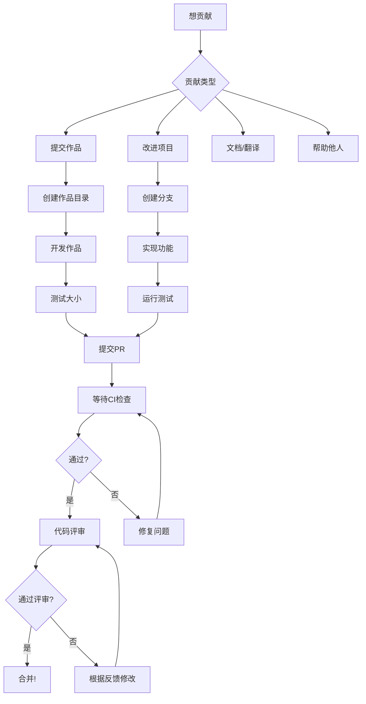

# 13 kib code 贡献指南
# CONTRIBUTING.md 贡献指南

欢迎来到 13 KiB Code 项目！我们很高兴你对参与这个创意编程挑战感兴趣。本指南将帮助你了解如何为项目做出贡献。

## 📋 贡献类型

我们欢迎各种形式的贡献：

### 1. 🎨 提交作品
- 参加月度挑战
- 自由创作任何 13 KiB 以内的项目
- 展示你的创意和技术

### 2. 🔍 评审与反馈
- 评审他人的作品
- 提供建设性的技术反馈
- 参与社区投票

### 3. 📚 文档改进
- 修复文档错误
- 添加更多示例
- 翻译文档
- 编写教程

### 4. 🔧 工具与自动化
- 改进 CI/CD 流程
- 开发辅助工具
- 创建测试框架

### 5. 🌟 社区支持
- 回答问题
- 帮助新参与者
- 推广项目

## 🚀 开始贡献

### 第一步：设置开发环境

1. **Fork 仓库**
   - 点击页面右上角的 "Fork" 按钮
   - 这会在你的账户下创建仓库的副本

2. **克隆仓库到本地**
   ```bash
   git clone https://github.com/你的用户名/13kib-code.git
   cd 13kib-code
   ```

3. **添加上游仓库**
   ```bash
   git remote add upstream https://github.com/lm-xiao-fen/13kib-code.git
   ```

### 第二步：选择贡献方式

#### 方式 A：提交新作品

1. **创建你的作品目录**
   ```bash
   # 进入 submissions 目录
   cd submissions
   
   # 创建你的作品目录
   # 格式：YYYY-MM-DD-你的GitHub用户名-项目名称
   mkdir 2024-05-10-yourusername-awesome-project
   ```

2. **复制模板（可选但推荐）**
   ```bash
   cp -r ../templates/submission-template/* 2024-05-10-yourusername-awesome-project/
   cd 2024-05-10-yourusername-awesome-project
   ```

3. **开发你的作品**
   - 编写代码，确保总大小 ≤ 13 KiB
   - 添加详细的 README.md
   - 包含运行说明和截图

4. **本地测试**
   ```bash
   # 返回项目根目录
   cd ../..
   
   # 运行大小检查
   node scripts/check-size.js
   
   # 运行结构验证
   node scripts/validate-structure.js
   ```

5. **提交更改**
   ```bash
   # 添加你的作品
   git add submissions/2024-05-10-yourusername-awesome-project/
   
   # 提交更改
   git commit -m "提交作品: 2024-05-10-yourusername-awesome-project"
   
   # 推送到你的 Fork
   git push origin main
   ```

#### 方式 B：改进项目本身

1. **创建新分支**
   ```bash
   git checkout -b feature/你的功能描述
   # 例如：git checkout -b feature/add-python-example
   ```

2. **进行更改**
   - 修复 Bug
   - 添加功能
   - 改进文档

3. **测试你的更改**
   ```bash
   # 运行测试（如果有）
   npm test
   
   # 检查脚本是否正常工作
   node scripts/check-size.js
   ```

4. **提交更改**
   ```bash
   git add .
   git commit -m "类型: 简要描述"
   
   # 推送到你的分支
   git push origin feature/你的功能描述
   ```

## 📁 提交规范

### 作品目录结构
```
submissions/
└── 2024-05-10-username-project/
    ├── src/              # 源代码
    ├── assets/           # 资源文件（图片、音频等）
    ├── README.md         # 项目说明（必需）
    ├── .13kibignore      # 忽略文件列表（可选）
    └── package.json      # 如果适用
```

### README.md 要求
每个作品必须包含 README.md，建议包含以下内容：

```markdown
# 项目名称

## 描述
简洁描述你的项目

## 功能特性
- 功能1
- 功能2

## 如何运行
```bash
# 运行命令
```

## 技术亮点
描述你的优化技巧

## 文件结构
```
项目结构
```

## 大小统计
- 总大小: X KiB / 13 KiB
- 主要文件: ...

## 作者
- 你的名字
- 链接到你的 GitHub
```

### 提交消息格式
我们使用约定式提交格式：

```
类型(范围): 描述

```

类型包括：
- `feat`: 新功能
- `fix`: 修复 Bug
- `docs`: 文档更新
- `style`: 代码格式调整
- `refactor`: 重构代码
- `test`: 测试相关
- `chore`: 构建过程或辅助工具的变动

示例：
```
feat(submission): 添加贪吃蛇游戏实现
docs: 更新贡献指南的示例部分
fix(check-size): 修复文件大小计算错误
```

## 🔍 代码评审

### 评审流程
1. **创建 Pull Request**
   - 前往你的 Fork
   - 点击 "New Pull Request"
   - 选择正确的分支
   - 填写 PR 描述

2. **自动检查**
   - CI/CD 会自动运行大小检查
   - 确保所有检查通过
   - 查看检查结果报告

3. **人工评审**
   - 维护者会评审你的代码
   - 可能会提出修改建议
   - 社区成员可以参与讨论

4. **合并**
   - 通过评审后，维护者会合并你的 PR
   - 你的作品会被添加到项目

### 评审标准
1. **作品符合 13 KiB 限制**
2. **代码质量**
   - 可读性
   - 适当的注释
   - 代码结构清晰
3. **文档完整**
   - README 包含必要信息
   - 运行说明清晰
4. **创意性**
   - 想法新颖
   - 实现有创意
5. **实用性**
   - 功能完整
   - 用户体验良好

## 🧪 开发指南

### 运行测试
```bash
# 运行所有检查
npm test

# 检查特定作品
node scripts/check-size.js submissions/2024-05-10-yourusername-project/

# 运行结构验证
node scripts/validate-structure.js
```

### 添加新功能
如果你想为项目本身添加功能：

1. **讨论你的想法**
   - 在 GitHub Issues 中创建新 issue
   - 描述你的功能想法
   - 等待维护者反馈

2. **实现功能**
   - 遵循现有代码风格
   - 添加必要的测试
   - 更新文档

3. **提交 PR**
   - 确保所有测试通过
   - 更新 CHANGELOG（如果适用）
   - 请求代码评审

### 代码风格
- 使用清晰的变量名和函数名
- 添加必要的注释
- 保持代码简洁
- 遵循项目现有的代码风格

## 🆘 获取帮助

### 有问题？
1. **查看现有文档**
   - 阅读 README.md
   - 查看 FAQ（如果存在）

2. **搜索 Issues**
   - 在 Issues 中搜索类似问题
   - 查看是否已有解决方案

3. **提问**
   - 在 Discussions 中提问
   - 在 Issues 中创建新 issue
   - 在 QQ 频道中询问

### 报告 Bug
1. **创建 Issue**
   - 使用 Bug Report 模板
   - 描述清晰的复现步骤
   - 包含你的环境信息

2. **提供信息**
   ```markdown
   ## 描述
   [清晰描述 Bug]
   
   ## 复现步骤
   1. 步骤1
   2. 步骤2
   3. 看到什么错误
   
   ## 期望行为
   [描述期望的行为]
   
   ## 环境
   - 操作系统：
   - Node.js 版本：
   - 项目版本：
   
   ## 截图/日志
   [如果有，请添加]
   ```

## 🤝 行为准则

### 社区准则
1. **尊重他人**
   - 保持友善和尊重的态度
   - 欢迎所有人，无论技术水平
   - 给予建设性反馈

2. **协作精神**
   - 帮助他人
   - 分享知识
   - 共同进步

3. **专业态度**
   - 保持专业
   - 解决问题为导向
   - 承认他人的贡献

### 禁止行为
- 人身攻击或侮辱性语言
- 骚扰行为
- 垃圾信息
- 恶意代码
- 任何违法或不道德行为

违反行为准则可能导致：
1. 警告
2. 临时禁言
3. 永久封禁

## 🎯 首次贡献者

如果你是首次贡献者，我们推荐：

### 入门任务
1. **修复文档错别字**
   - 找到文档中的错误
   - 提交修复

2. **添加示例**
   - 编写简单示例
   - 添加到 examples 目录

3. **改进模板**
   - 优化提交模板
   - 添加更多示例

### 寻找任务
- 查看标记为 `good-first-issue` 的 Issues
- 查看标记为 `help-wanted` 的 Issues
- 在 Discussions 中询问

## 🔄 保持同步

定期从上游仓库拉取更新：

```bash
# 获取上游更新
git fetch upstream  

# 合并到你的分支
git merge upstream/main

# 推送到你的 Fork
git push origin main
```

## 📄 许可证

### 你的权利
- 你保留提交作品的版权
- 你授予项目展示和分享的权利
- 你可以在其他项目中使用你的代码

### 使用许可
- 项目采用 MIT 许可证
- 提交即表示你同意此许可
- 查看 LICENSE 了解详情

## 💖 致谢

感谢你的贡献！每一份贡献，无论大小，都让这个项目变得更好。

你的名字将被记录在：
- 提交历史中
- 贡献者列表中
- 项目文档中

---

## 📈 贡献流程总结



## 问题与支持

如果你遇到任何问题：
- 在 Issues 中搜索
- 创建新的 Issue
- 在 Discussions 中提问
- 在 QQ 频道中询问

---

感谢你为 13 KiB Code 项目做出贡献！🎉

**每一行代码，每一个想法，每一次分享，都在让这个社区变得更好。**
